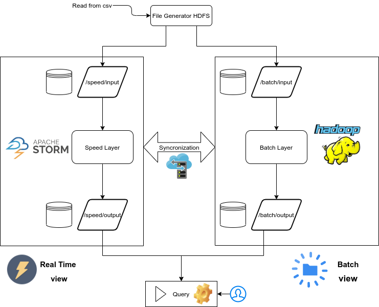

# Sentiment Analysis

Calculating arbitrary functions on large real-time data sets is a difficult task. In this study a possible approach to problems of this type is shown: as an example task we consider the analysis of the feelings of the tweets. Instead of getting tweets through the Twitter API, we simulate issuing them by reading them from the sentiment140 dataset.
In our scenario we create a Lambda Architecture that uses Apache Hadoop for the Batch Layer, Apache Storm for the Speed
Layer and HDFS for data management. We use LingPipe to classify tweets using computational linguistics.
This architecture allows to harness the full power of a computer cluster for data processing, is easily scalable, and meets low latency requirements for answering queries in real time.

## Software requirements
* Java JDK: open jdk 11
* Apache Hadoop 2.9.2
* Apache Storm 2.1.0
* HdfsSpout Apache Storm 2.1.0
* LingPipe 4.1.2
* jfreechart 1.0.1

## Dataset
Sentiment140, 1.6 million tweets with annotated sentiment: [download](https://www.kaggle.com/kazanova/sentiment140)

### Download this repo
* `git clone https://github.com/fedem96/SentimentAnalysis-LambdaArchitecture.git`

### Run all the process
Import all jar/libraries in your project and test Hadoop configuration.
[Set up a single node cluster guide Hadoop](https://hadoop.apache.org/docs/r2.9.2/hadoop-project-dist/hadoop-common/SingleCluster.html)

* `Classifier` edit configuration and set args[0]=dataset_file and args[1]=file in which save the classifier
* `Generator` edit configuration and set args[0]=dataset_file to generate tweets on HDFS
* `Batch Layer` no parameters need in args. Run after Generator
* `Speed Layer` no parameters need in args. Run after Generator
* `Query Gui` no parameters in args. Run after Batch and Speed layer
* `Clear` no parameters need in args. Used to clear all the directories in the HDFS before running a new simulation
